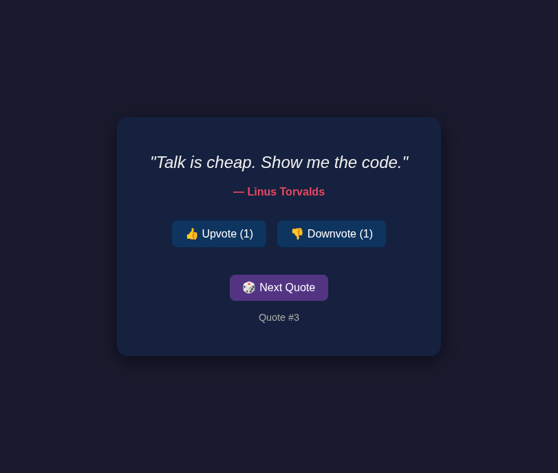
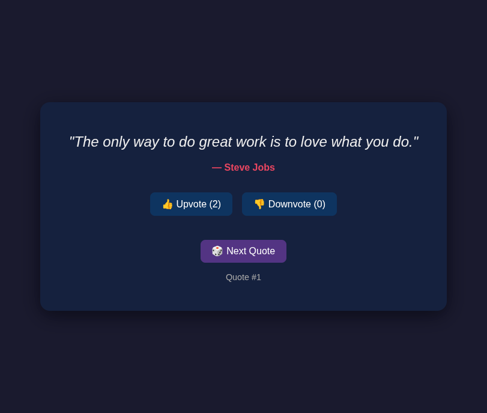
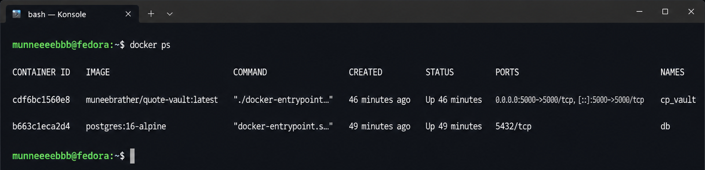
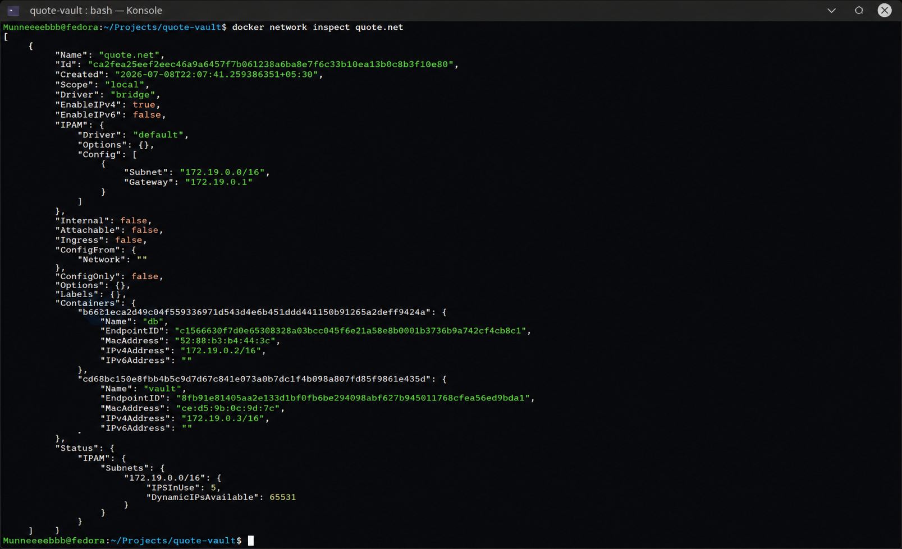

# Quote Vault

A lightweight Flask application that serves random quotes from a PostgreSQL database. This project was built to practice Docker fundamentals including Dockerfiles, custom networking, persistent volumes, and container communication.

---

## Features

- 🎲 Random quote generator
- 👍 Upvote and 👎 downvote quotes
- 🐘 PostgreSQL database
- 🌐 Simple Flask web application
- 🐳 Fully containerized using Docker

---

## Tech Stack

- Python 3.11
- Flask
- PostgreSQL 16
- Gunicorn
- Docker

---

## Docker Concepts Demonstrated

- Writing a Dockerfile from scratch
- Layer caching optimization
- Custom Docker bridge network
- Container-to-container communication using Docker DNS
- Docker volumes for persistent database storage
- Optimized images using `.dockerignore`
- Gunicorn as the production WSGI server
- Environment variables for configuration

---

## Project Structure

```
quote-vault/
├── app/
│   ├── templates/
│   │   └── index.html
│   ├── __init__.py
│   └── main.py
├── Dockerfile
├── docker-entrypoint.sh
├── requirements.txt
├── .dockerignore
├── .gitignore
├── LICENSE
└── README.md
```

---

## Getting Started

### 1. Create a Docker network

```bash
docker network create quote.net
```

### 2. Run PostgreSQL

```bash
docker run -d \
  --name db \
  --network quote.net \
  -e POSTGRES_USER=quotes \
  -e POSTGRES_PASSWORD=quotes \
  -e POSTGRES_DB=quotes \
  -v quote-data:/var/lib/postgresql/data \
  postgres:16-alpine
```

### 3. Build the application image

```bash
docker build -t quote-vault:latest .
```

### 4. Run the Flask application

```bash
docker run -d \
  --name vault \
  --network quote.net \
  -e DB_HOST=db \
  -e DB_USER=quotes \
  -e DB_PASS=quotes \
  -e DB_NAME=quotes \
  -p 5000:5000 \
  quote-vault:latest
```

---

## Access the Application

Open your browser and visit:

```
http://localhost:5000
```

---

## Screenshots

### Home Page


### Upvoting a Quote


### Running Containers


### Network Verification


---

## Skills Demonstrated

- Docker
- Docker Images
- Docker Containers
- Docker Networking
- Docker Volumes
- Environment Variables
- Flask
- PostgreSQL
- Gunicorn
- Linux

---

## Author

**Muneeb Ahmad Rather**